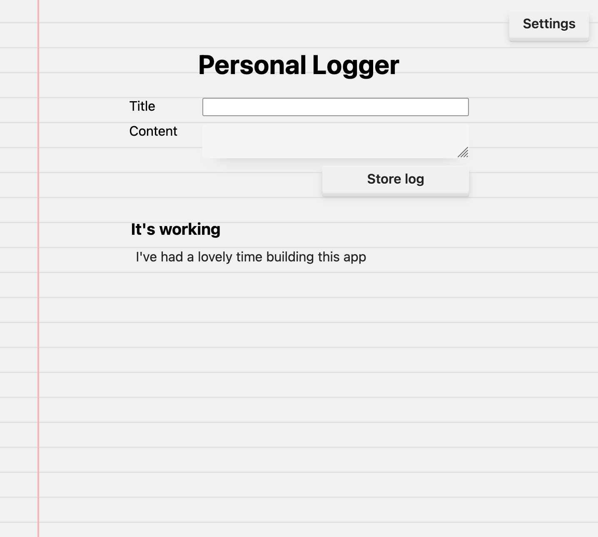

# Personal Logger

A simple tool for simple journaling



## Built with
- [lamdera](https://lamdera.com/) for platform and hosting
- [@ryannhg/css-in-elm](https://www.npmjs.com/package/@ryannhg/css-in-elm) for CSS code generation
- [elm-format](https://github.com/avh4/elm-format) for code formatting
- [elm-review](https://www.npmjs.com/package/elm-review) for code review and cleanup
- [run-pty](https://www.npmjs.com/package/run-pty) for running the dev environment in a clean and easy manner


## Getting Started

Clone this template, install Lamdera, then run

```sh
npm install
npm run dev
```
